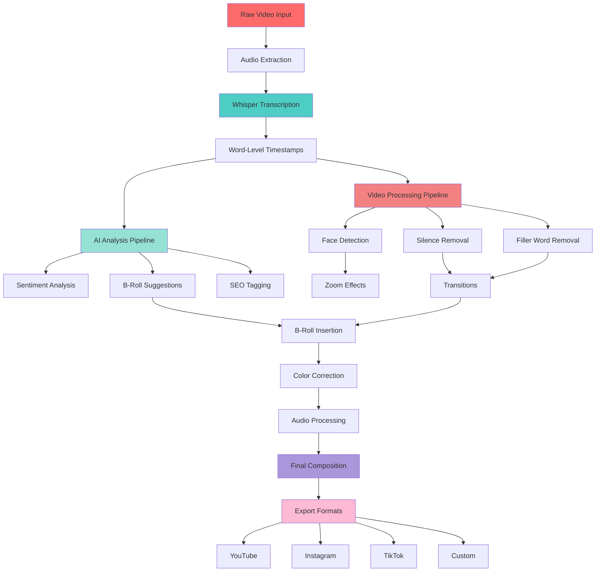
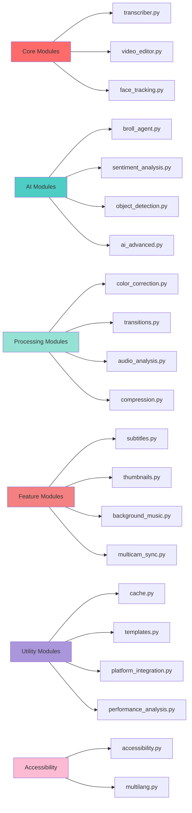
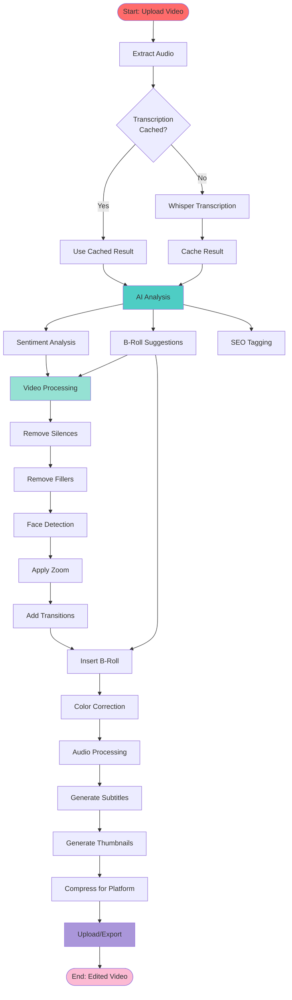
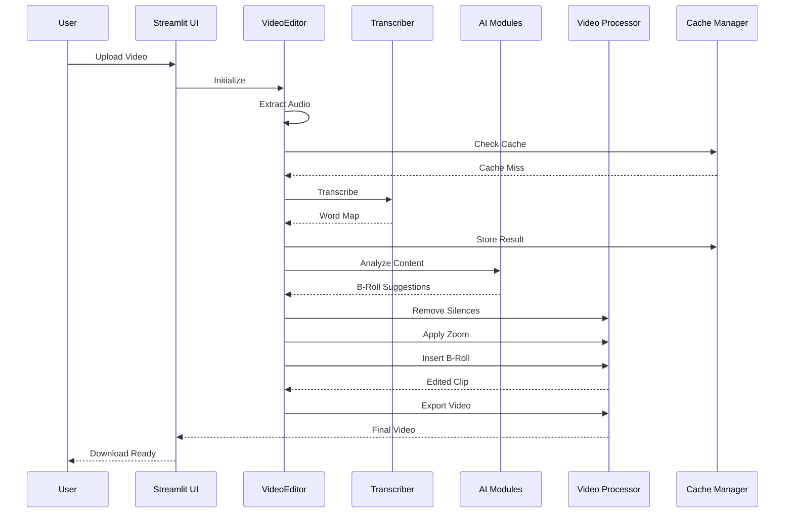

# 🎬 FFmpeg Wizard: AI-Powered Autonomous Video Editor

<div align="center">


**The Ultimate AI-Powered Video Editing Solution**

*Transform raw footage into professional videos automatically*

[Features](#-features) • [Quick Start](#-quick-start) • [Documentation](#-documentation) • [Examples](#-examples)

</div>

---

## 📋 Table of Contents

- [Overview](#-overview)
- [Features](#-features)
- [Architecture](#-architecture)
- [Installation](#-installation)
- [Quick Start](#-quick-start)
- [Usage Examples](#-usage-examples)
- [API Documentation](#-api-documentation)
- [Advanced Features](#-advanced-features)
- [Troubleshooting](#-troubleshooting)
- [Contributing](#-contributing)

---

## 🎯 Overview

**FFmpeg Wizard** is an autonomous AI-powered video editing agent that transforms raw video footage into professionally edited content. It combines cutting-edge AI technologies (Whisper, OpenAI GPT, Computer Vision) with powerful video processing capabilities to automate the entire editing workflow.

### What Makes It Special?

- 🤖 **Fully Autonomous**: Upload raw video, get edited output - no manual editing required
- 🧠 **AI-Powered**: Uses GPT-4 for intelligent content analysis and B-Roll suggestions
- 🎨 **Professional Quality**: Applies industry-standard editing techniques automatically
- ⚡ **Fast Processing**: Optimized pipeline with caching and parallel processing
- 🌐 **Multi-Platform**: Export optimized videos for YouTube, Instagram, TikTok, and more
- ♿ **Accessible**: Built-in accessibility features (captions, audio descriptions, high contrast)

---

## ✨ Features

### Core Editing Features

<details>
<summary><b>🎤 Automatic Transcription with Word-Level Timestamps</b></summary>

- Uses Faster-Whisper for accurate, fast transcription
- Word-level timestamps for precise editing
- Supports 50+ languages
- Voice Activity Detection (VAD) for better accuracy

```python
from transcriber import transcribe_video

word_map = transcribe_video("audio.wav")
# Returns: [{"word": "Hello", "start": 0.5, "end": 0.8, "confidence": 0.95}, ...]
```
</details>

<details>
<summary><b>✂️ Intelligent Silence Removal</b></summary>

- Detects and removes long pauses automatically
- Configurable silence threshold (default: 1.0s)
- Preserves natural speech rhythm
- Smart gap detection between words

```python
edited_video = editor.remove_silence(word_map, min_silence_duration=1.0)
```
</details>

<details>
<summary><b>🗑️ Filler Word Detection & Removal</b></summary>

- Automatically detects "um", "uh", "like", "you know", etc.
- Removes filler words while maintaining flow
- Configurable filler word list
- Preserves natural pauses

```python
filler_segments = detect_filler_words(word_map)
edited_video = editor.remove_filler_words(filler_segments)
```
</details>

<details>
<summary><b>🔍 Punch-in Zoom Effects</b></summary>

- Smooth zoom effects on jump cuts
- Face-aware zoom (focuses on detected faces)
- Configurable zoom factor (default: 1.1x)
- Prevents awkward framing

```python
edited_video = editor.apply_punch_in_zoom(clip, zoom_factor=1.1, face_center=face_pos)
```
</details>

<details>
<summary><b>🎥 Intelligent B-Roll Insertion</b></summary>

- AI analyzes transcript to suggest B-Roll moments
- Automatically searches and downloads stock footage (Pexels)
- Inserts B-Roll at optimal timestamps
- Seamless compositing

```python
suggestions = analyze_context_for_broll(word_map, transcript_text)
broll_videos = get_broll_videos(suggestions)
final_video = editor.insert_broll(main_clip, broll_videos)
```
</details>

### Advanced Features

<details>
<summary><b>📝 Automatic Subtitles (SRT/VTT)</b></summary>

- Generates professional subtitle files
- Multiple formats: SRT, WebVTT
- Customizable styling (fonts, colors, positioning)
- Burn subtitles into video option

```python
from subtitles import generate_srt, generate_vtt

generate_srt(word_map, "subtitles.srt")
generate_vtt(word_map, "subtitles.vtt")
```
</details>

<details>
<summary><b>📊 Sentiment & Rhythm Analysis</b></summary>

- Analyzes energy levels throughout video
- Identifies high-engagement moments
- Pacing analysis (words per minute)
- Suggests improvements

```python
from sentiment_analysis import analyze_sentiment, analyze_pacing

sentiment = analyze_sentiment(word_map, transcript_text)
pacing = analyze_pacing(word_map)
high_engagement = detect_engagement_moments(sentiment)
```
</details>

<details>
<summary><b>🎨 Automatic Color Correction</b></summary>

- Auto white balance
- Exposure correction
- LUT application (cinematic, vlog, corporate)
- Content-aware color grading

```python
from color_correction import ColorCorrector

corrector = ColorCorrector()
corrected = corrector.correct_video(
    "input.mp4",
    "output.mp4",
    corrections={
        'white_balance': True,
        'exposure': True,
        'lut': 'cinematic'
    }
)
```
</details>

<details>
<summary><b>🎬 Intelligent Transitions</b></summary>

- Smooth transitions between cuts
- Multiple types: fade, zoom, slide, dip-to-black
- Motion-based transition selection
- Configurable duration

```python
from transitions import add_transitions_to_clips

final = add_transitions_to_clips(clips, transition_type="fade", duration=0.5)
```
</details>

<details>
<summary><b>🎵 Adaptive Background Music</b></summary>

- AI suggests music style based on content
- Automatic volume ducking (lowers during speech)
- Tempo synchronization
- Seamless mixing

```python
from background_music import BackgroundMusicManager

manager = BackgroundMusicManager()
music_style = manager.analyze_content_for_music(transcript_text, sentiment)
mixed_audio = manager.mix_audio(speech_audio, music_path, word_map, ducking=True)
```
</details>

<details>
<summary><b>🖼️ Automatic Thumbnail Generation</b></summary>

- Selects best frames automatically
- Quality and composition analysis
- Multiple variations with styling
- Title overlay option

```python
from thumbnails import ThumbnailGenerator

generator = ThumbnailGenerator()
thumbnails = generator.generate_thumbnails(
    "video.mp4",
    sentiment_segments,
    "output_dir",
    title="My Video Title"
)
```
</details>

<details>
<summary><b>🏷️ Object Detection & SEO Tagging</b></summary>

- Detects objects in video frames
- Generates SEO tags automatically
- Title and description suggestions
- Keyword extraction

```python
from object_detection import generate_seo_metadata

metadata = generate_seo_metadata("video.mp4", transcript_text)
# Returns: tags, title, description, keywords, topics
```
</details>

<details>
<summary><b>📹 Multi-Camera Synchronization</b></summary>

- Syncs multiple camera angles using audio fingerprinting
- Automatic switching between cameras
- Picture-in-picture mode
- Seamless multi-cam editing

```python
from multicam_sync import MultiCamSyncer

syncer = MultiCamSyncer()
sync_info = syncer.sync_videos(["cam1.mp4", "cam2.mp4", "cam3.mp4"])
multicam_video = syncer.create_multicam_edit(video_paths, sync_info, switch_times)
```
</details>

<details>
<summary><b>💾 Intelligent Compression</b></summary>

- Platform-specific presets (YouTube, Instagram, TikTok)
- Quality vs size optimization
- Batch processing
- Size estimation

```python
from compression import VideoCompressor

compressor = VideoCompressor()
compressed = compressor.compress_video("input.mp4", "output.mp4", preset="youtube")
```
</details>

<details>
<summary><b>⚡ Caching & Optimization</b></summary>

- Caches transcriptions (avoid re-processing)
- Redis support for distributed caching
- File-based fallback
- Cache statistics

```python
from cache import CacheManager

cache = CacheManager()
cached = cache.get_cached_transcription("audio.wav")
if not cached:
    word_map = transcribe_video("audio.wav")
    cache.cache_transcription("audio.wav", word_map)
```
</details>

<details>
<summary><b>📋 Templates & Presets</b></summary>

- Pre-configured templates (tutorial, vlog, podcast, cinematic)
- Custom template creation
- Template sharing
- Quick apply

```python
from templates import TemplateManager

manager = TemplateManager()
template = manager.get_template("vlog")
settings = manager.apply_template("vlog", base_settings)
```
</details>

<details>
<summary><b>📤 Platform Integration</b></summary>

- Direct YouTube upload
- Scheduled publishing
- Platform-specific export
- Upload status tracking

```python
from platform_integration import PlatformUploader

uploader = PlatformUploader()
video_id = uploader.upload_to_youtube(
    "video.mp4",
    title="My Video",
    description="Description",
    tags=["tag1", "tag2"]
)
```
</details>

<details>
<summary><b>🔊 Advanced Audio Analysis</b></summary>

- Volume normalization
- Noise reduction
- EQ adjustment
- Click/pop detection and removal

```python
from audio_analysis import AudioProcessor

processor = AudioProcessor()
processed = processor.process_audio(
    "audio.wav",
    normalize=True,
    reduce_noise=True,
    eq_settings={'low_gain': 2, 'high_gain': 1}
)
```
</details>

<details>
<summary><b>⏱️ Visual Timeline Editor</b></summary>

- Timeline-based editing interface
- Drag-and-drop segment management
- Fine-tune cuts
- EDL export

```python
from timeline_editor import TimelineEditor

editor = TimelineEditor()
editor.add_segment(0, 10, "video")
editor.add_segment(15, 25, "video")
final = editor.create_video_from_timeline("source.mp4", "output.mp4")
```
</details>

<details>
<summary><b>🌍 Multi-Language Support</b></summary>

- Transcription in 50+ languages
- Automatic translation
- Multi-language subtitles
- TTS dubbing

```python
from multilang import MultiLanguageProcessor

processor = MultiLanguageProcessor()
subtitles = processor.generate_subtitles_multilang(
    "audio.wav",
    languages=["en", "es", "fr"],
    output_dir="subtitles"
)
```
</details>

<details>
<summary><b>📈 Performance Analysis</b></summary>

- Detailed before/after statistics
- Time saved metrics
- File size reduction
- Pacing improvements
- Session history

```python
from performance_analysis import PerformanceAnalyzer

analyzer = PerformanceAnalyzer()
stats = analyzer.analyze_editing_session(
    "original.mp4",
    "edited.mp4",
    word_map,
    settings
)
report = analyzer.generate_report(stats)
```
</details>

<details>
<summary><b>👥 Collaboration Features</b></summary>

- Project sharing
- Version control
- Comments and reviews
- Approval workflow

```python
from collaboration import CollaborationManager

manager = CollaborationManager()
project_id = manager.create_project("My Project", "video.mp4", "user1")
manager.add_version(project_id, "edited.mp4", "user2", notes="First edit")
manager.add_comment(project_id, "user1", "Great work!", timestamp=10.5)
```
</details>

<details>
<summary><b>🤖 Advanced AI Features</b></summary>

- Script generation from topics
- Speech quality analysis
- Repetition detection
- Clarity scoring
- Improvement suggestions

```python
from ai_advanced import AdvancedAI

ai = AdvancedAI()
script = ai.generate_script_from_topics(["Python", "AI", "Video Editing"], style="tutorial")
analysis = ai.analyze_speech_quality(word_map, transcript_text)
suggestions = ai.suggest_improvements(transcript_text, word_map)
```
</details>

<details>
<summary><b>♿ Accessibility Features</b></summary>

- Descriptive captions (with action descriptions)
- Audio descriptions
- High contrast mode
- Complete accessibility package

```python
from accessibility import AccessibilityManager

manager = AccessibilityManager()
package = manager.generate_accessibility_package(
    "video.mp4",
    word_map,
    transcript_text,
    "output_dir"
)
# Returns: subtitles, audio description, high contrast video
```
</details>

---

## 🏗️ Architecture

### System Architecture



### Module Structure



### Processing Pipeline Flow



### Data Flow



---

## 🚀 Installation

### Prerequisites

1. **FFmpeg** (required)
   ```bash
   # macOS
   brew install ffmpeg
   
   # Linux
   sudo apt-get install ffmpeg
   
   # Windows
   # Download from https://ffmpeg.org
   ```

2. **Python 3.8+**
   ```bash
   python --version  # Should be 3.8 or higher
   ```

3. **Optional: Redis** (for caching)
   ```bash
   # macOS
   brew install redis
   
   # Linux
   sudo apt-get install redis-server
   ```

### Installation Steps

1. **Clone the repository**
   ```bash
   git clone https://github.com/yourusername/ffmpeg-wizard.git
   cd ffmpeg-wizard
   ```

2. **Create virtual environment** (recommended)
   ```bash
   python -m venv venv
   source venv/bin/activate  # On Windows: venv\Scripts\activate
   ```

3. **Install dependencies**
   ```bash
   pip install -r requirements.txt
   ```

4. **Set up environment variables**
   ```bash
   cp .env.example .env
   ```
   
   Edit `.env`:
   ```env
   # Required for B-Roll and AI features
   OPENAI_API_KEY=sk-your-key-here
   PEXELS_API_KEY=your-pexels-key-here
   
   # Optional: Whisper configuration
   WHISPER_DEVICE=cpu  # or 'cuda' for GPU
   WHISPER_MODEL=small  # tiny, base, small, medium, large
   
   # Optional: Redis for caching
   REDIS_URL=redis://localhost:6379
   ```

5. **Verify installation**
   ```bash
   python -c "import moviepy; import faster_whisper; print('Installation successful!')"
   ```

---

## 🎬 Quick Start

### Web Interface (Recommended)

1. **Launch Streamlit app**
   ```bash
   streamlit run app.py
   ```

2. **Open browser**
   - Navigate to `http://localhost:8501`
   - Upload your video file
   - Configure settings in sidebar
   - Click "Process Video"
   - Download edited video when complete

### Command Line Interface

**Basic usage:**
```bash
python main.py input_video.mp4 -o output_edited.mp4
```

**With all features:**
```bash
python main.py input_video.mp4 -o output.mp4 \
    --broll \
    --min-silence 0.8
```

**Available options:**
```bash
python main.py --help

Options:
  -o, --output PATH          Output video path
  --no-silence-removal       Disable silence removal
  --no-filler-removal        Disable filler word removal
  --no-zoom                  Disable zoom effects
  --broll                    Enable B-Roll insertion
  --min-silence FLOAT        Min silence duration (default: 1.0)
```

### Python API

```python
from video_editor import VideoEditor

# Basic editing
with VideoEditor("raw_video.mp4") as editor:
    edited = editor.process_video(
        remove_silences=True,
        remove_fillers=True,
        apply_zoom=True
    )
    editor.export_video(edited, "output.mp4")

# Advanced editing with B-Roll
from broll_agent import analyze_context_for_broll, get_broll_videos
from transcriber import transcribe_video

with VideoEditor("raw_video.mp4") as editor:
    audio_path = editor.extract_audio()
    word_map = transcribe_video(audio_path)
    transcript = " ".join([w['word'] for w in word_map])
    
    # Get B-Roll suggestions
    suggestions = analyze_context_for_broll(word_map, transcript)
    broll_videos = get_broll_videos(suggestions)
    
    # Process video
    edited = editor.process_video(
        remove_silences=True,
        remove_fillers=True,
        apply_zoom=True,
        insert_broll=True,
        broll_suggestions=broll_videos
    )
    
    editor.export_video(edited, "output.mp4")
```

---

## 📚 Usage Examples

### Example 1: Basic Video Editing

```python
from video_editor import VideoEditor

with VideoEditor("tutorial.mp4") as editor:
    # Process with default settings
    edited = editor.process_video(
        remove_silences=True,
        remove_fillers=True,
        apply_zoom=True
    )
    
    # Export
    editor.export_video(edited, "tutorial_edited.mp4")
```

### Example 2: Generate Subtitles

```python
from transcriber import transcribe_video
from subtitles import generate_srt, generate_vtt

# Transcribe
word_map = transcribe_video("audio.wav")

# Generate subtitles
generate_srt(word_map, "subtitles.srt")
generate_vtt(word_map, "subtitles.vtt")
```

### Example 3: Multi-Language Subtitles

```python
from multilang import MultiLanguageProcessor

processor = MultiLanguageProcessor()

# Generate subtitles in multiple languages
subtitles = processor.generate_subtitles_multilang(
    "audio.wav",
    languages=["en", "es", "fr", "de"],
    output_dir="subtitles"
)

# Access files
print(subtitles["en"])  # subtitles/en.srt
print(subtitles["es"])  # subtitles/es.srt
```

### Example 4: Platform-Specific Export

```python
from compression import VideoCompressor

compressor = VideoCompressor()

# Export for YouTube
compressor.compress_video("video.mp4", "youtube.mp4", preset="youtube")

# Export for Instagram
compressor.compress_video("video.mp4", "instagram.mp4", preset="instagram")

# Export for TikTok
compressor.compress_video("video.mp4", "tiktok.mp4", preset="tiktok")
```

### Example 5: Using Templates

```python
from templates import TemplateManager
from video_editor import VideoEditor

manager = TemplateManager()

# Get vlog template
template = manager.get_template("vlog")
settings = template["settings"]

# Apply template
with VideoEditor("raw_vlog.mp4") as editor:
    edited = editor.process_video(**settings)
    editor.export_video(edited, "vlog_edited.mp4")
```

### Example 6: Performance Analysis

```python
from performance_analysis import PerformanceAnalyzer

analyzer = PerformanceAnalyzer()

# Analyze editing session
stats = analyzer.analyze_editing_session(
    "original.mp4",
    "edited.mp4",
    word_map,
    settings
)

# Generate report
report = analyzer.generate_report(stats)
print(report)

# Save history
analyzer.save_history("history.json")
```

### Example 7: Collaboration Workflow

```python
from collaboration import CollaborationManager

manager = CollaborationManager()

# Create project
project_id = manager.create_project(
    "My Video Project",
    "raw_video.mp4",
    owner="user1",
    description="Tutorial video editing"
)

# Add collaborators
manager.add_collaborator(project_id, "user2")
manager.add_collaborator(project_id, "user3")

# Add version
version = manager.add_version(
    project_id,
    "edited_v1.mp4",
    author="user2",
    notes="First edit - removed silences"
)

# Add comment
comment = manager.add_comment(
    project_id,
    author="user1",
    text="Great work! Consider adding B-Roll at 0:30",
    timestamp=30.0,
    version_id=version["id"]
)

# Approve version
manager.approve_version(project_id, version["id"], approver="user1")
```

---

## 🔧 Advanced Configuration

### Whisper Model Selection

Choose based on your needs:

| Model | Speed | Accuracy | Use Case |
|-------|-------|----------|----------|
| `tiny` | ⚡⚡⚡⚡⚡ | ⭐⭐ | Fast preview, low accuracy OK |
| `base` | ⚡⚡⚡⚡ | ⭐⭐⭐ | Good balance |
| `small` | ⚡⚡⚡ | ⭐⭐⭐⭐ | **Recommended** |
| `medium` | ⚡⚡ | ⭐⭐⭐⭐⭐ | High accuracy needed |
| `large` | ⚡ | ⭐⭐⭐⭐⭐ | Maximum accuracy |

```env
WHISPER_MODEL=small  # Change in .env
```

### GPU Acceleration

For NVIDIA GPUs, enable CUDA:

```env
WHISPER_DEVICE=cuda
```

This can speed up transcription by 5-10x.

### Caching Configuration

Enable Redis for distributed caching:

```env
REDIS_URL=redis://localhost:6379
```

Or use file-based caching (default).

---

## 🐛 Troubleshooting

### Common Issues

<details>
<summary><b>FFmpeg not found</b></summary>

**Problem:** `FFmpegNotFoundError`

**Solution:**
```bash
# Verify installation
ffmpeg -version

# Add to PATH if needed
export PATH=$PATH:/path/to/ffmpeg
```
</details>

<details>
<summary><b>Out of memory errors</b></summary>

**Problem:** `MemoryError` during processing

**Solutions:**
- Use smaller Whisper model (`tiny` or `base`)
- Process shorter video segments
- Reduce video resolution before processing
- Close other applications
</details>

<details>
<summary><b>B-Roll not working</b></summary>

**Problem:** No B-Roll videos inserted

**Solutions:**
- Check API keys in `.env`
- Verify internet connection
- Check Pexels API rate limits
- Review B-Roll suggestions in console output
</details>

<details>
<summary><b>Slow transcription</b></summary>

**Problem:** Transcription takes too long

**Solutions:**
- Use GPU acceleration (`WHISPER_DEVICE=cuda`)
- Use smaller model (`WHISPER_MODEL=tiny`)
- Enable caching (transcriptions are cached)
- Process audio separately first
</details>

<details>
<summary><b>Face detection fails</b></summary>

**Problem:** Zoom effects don't focus on faces

**Solutions:**
- Ensure good lighting in video
- Face should be clearly visible
- Falls back to center zoom if no face detected
- Check OpenCV installation
</details>

---

## 📊 Performance Benchmarks

### Processing Times (on M1 MacBook Pro)

| Video Length | Model | Processing Time | Features |
|-------------|-------|----------------|----------|
| 1 minute | small | ~30 seconds | Basic editing |
| 5 minutes | small | ~2 minutes | Basic editing |
| 10 minutes | small | ~4 minutes | Basic editing |
| 1 minute | small | ~45 seconds | Full features |
| 5 minutes | small | ~3 minutes | Full features |

*Times include transcription, editing, and export*

### File Size Reduction

Average reduction: **20-40%** (depending on silence removal)

---

## 🤝 Contributing

We welcome contributions! Please see our [Contributing Guidelines](CONTRIBUTING.md).

### Development Setup

```bash
# Clone repository
git clone https://github.com/yourusername/ffmpeg-wizard.git
cd ffmpeg-wizard

# Create virtual environment
python -m venv venv
source venv/bin/activate

# Install development dependencies
pip install -r requirements.txt
pip install -r requirements-dev.txt

# Run tests
pytest tests/

# Run linter
flake8 .
```

---

## 📄 License

MIT License - see [LICENSE](LICENSE) file for details.

---

## 🙏 Acknowledgments

- [Faster-Whisper](https://github.com/guillaumekln/faster-whisper) - Fast, accurate transcription
- [MoviePy](https://github.com/Zulko/moviepy) - Powerful video editing library
- [OpenCV](https://opencv.org/) - Computer vision and face detection
- [OpenAI](https://openai.com/) - GPT models for AI analysis
- [Pexels](https://www.pexels.com/) - Stock footage API
- [Streamlit](https://streamlit.io/) - Beautiful web interface

---

## 📧 Support & Contact

- **Issues:** [GitHub Issues](https://github.com/yourusername/ffmpeg-wizard/issues)
- **Discussions:** [GitHub Discussions](https://github.com/yourusername/ffmpeg-wizard/discussions)
- **Email:** support@ffmpeg-wizard.com

---

<div align="center">

**Made with ❤️ for content creators worldwide**

[⭐ Star us on GitHub](https://github.com/yourusername/ffmpeg-wizard) • [📖 Documentation](https://docs.ffmpeg-wizard.com) • [🐛 Report Bug](https://github.com/yourusername/ffmpeg-wizard/issues)

</div>
